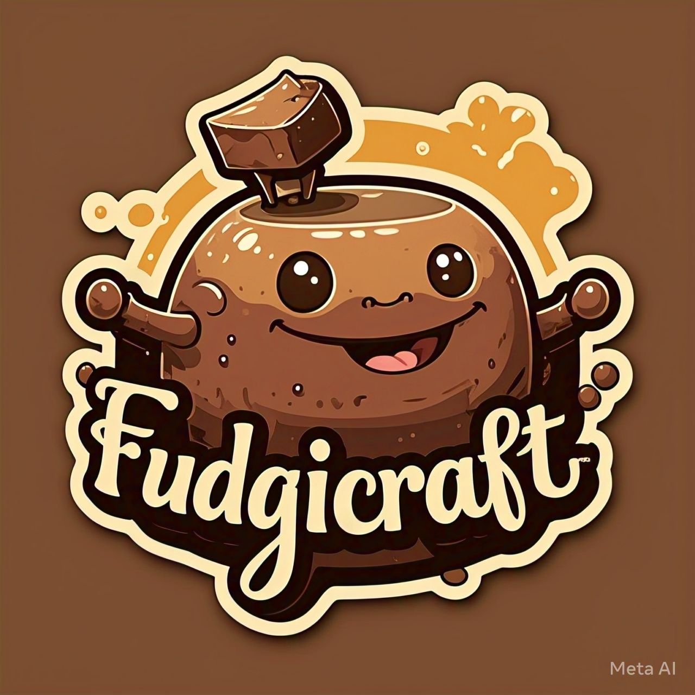

# FudgiCraft - Homemade Brownie Bakery 🍫

A clean, responsive, and user-friendly static website for **FudgiCraft**, a home-based bakery specializing in rich, fudgy brownies.

## ✨ Features

- Fully responsive design using Bootstrap 5
- Beautiful hero section with call-to-action
- Specials showcase with popular flavors (Lotus Biscoff, Nutella, Cheesecake)
- Complete menu with pricing
- Simple and clean order form
- Contact form for customer inquiries
- Professional navigation across all pages

## 🛠️ Tech Stack

- **HTML5**
- **CSS3**
- **Bootstrap 5.3**
- **Responsive Design**

## 📸 Screenshots

*(You can add screenshots later)*

## 🚀 Live Demo

**[View Live Website](https://meenuvp.github.io/FudgiCraft-Responsive-Bakery-Ordering-System)**

> *Note: Make sure to update the link after enabling GitHub Pages*

## 📂 Project Structure
